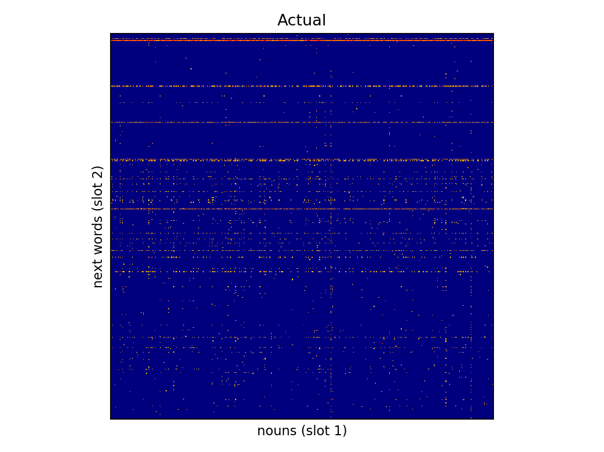
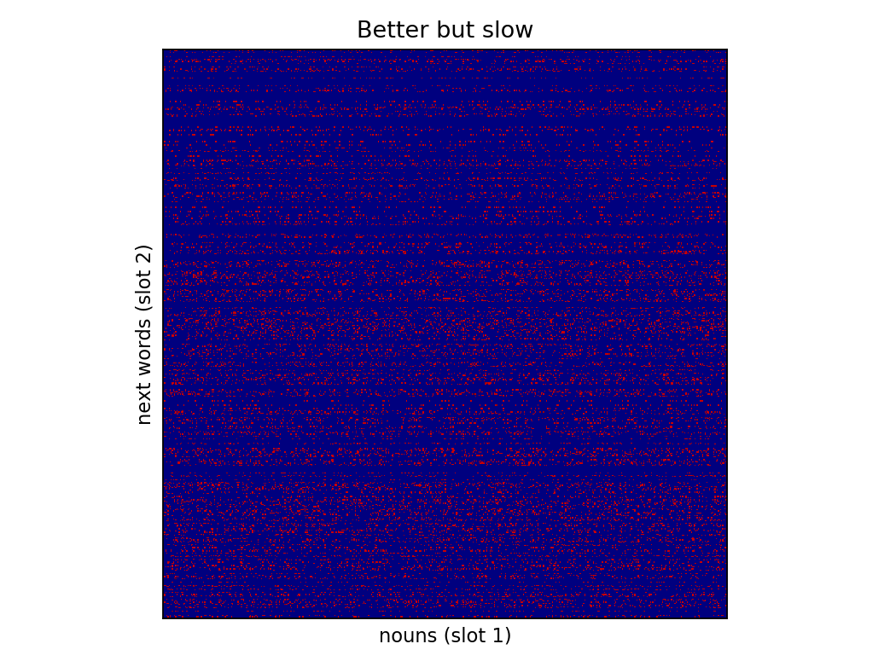
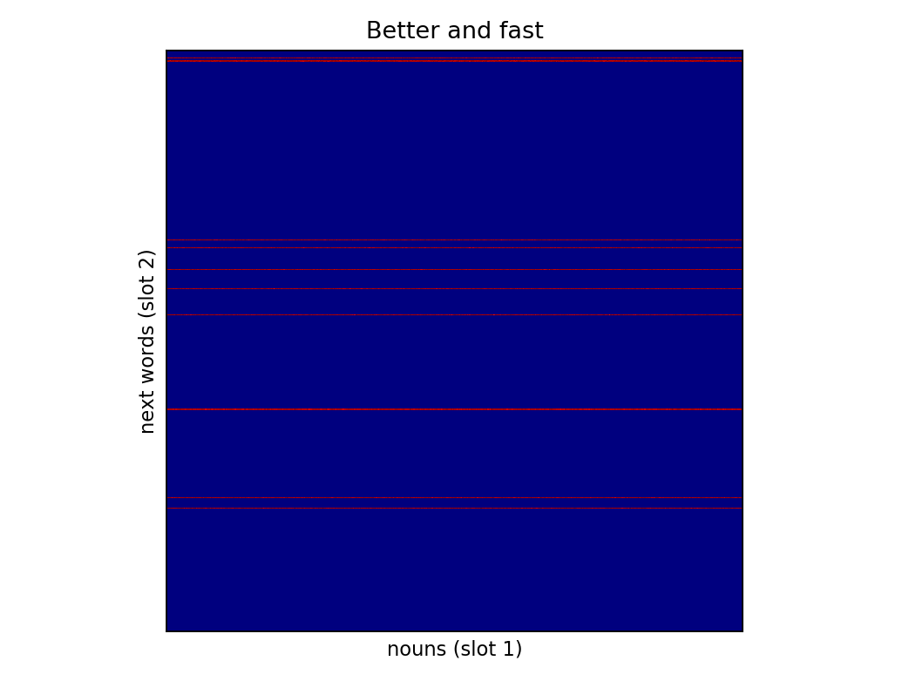
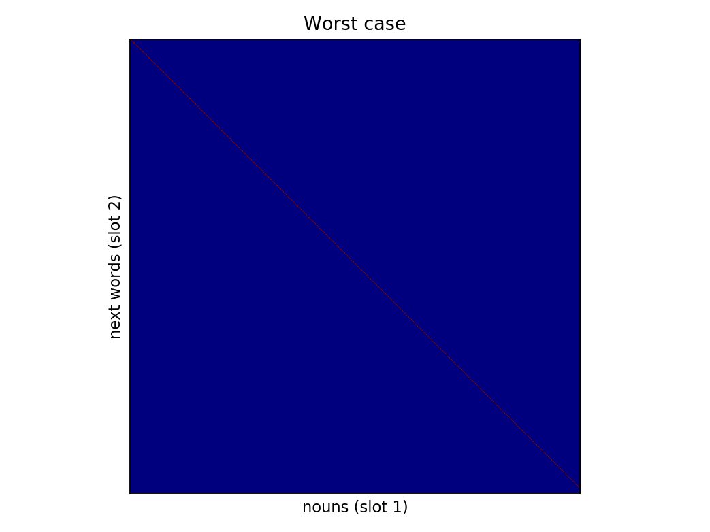

# Order Matters

Research code to demonstrate theory behind ordering data for training neural networks.

## Background

Many practitioners ignore the order in which their learning models are trained on data by shuffling the input prior to training.
Yet, in many cases, learning may benefit from ordered training data.
This is due to the progressive differentiation underlying the learning dynamics of many neural networks.
  
### Co-occurrence Distributions & Entropy

The current proposal is specific to learning lexical categories by predicting sequences of natural language. 
Though, it could be applied to any category learning problems.

Imagine 2-word sequences sampled from a natural language corpus.
Imagine, the goal is to learn the noun category.
That is, the network should learn representations for nouns that are as similar as possible to each other, and as different as possible from non-nouns.
Assume the network is an RNN tasked to predict the second word in all 2-word sequences.
Whenever the word in slot 1 is a noun, the noun's representation is updated based on the error in predicting the word in slot 2.
That is, the category information about the word in slot 1 originates in the distribution of words in slot 2.

We can plot the co-occurrence pattern for slot 1 and slot 2 in a natural language corpus (AO-CHILDES) for only those sequences in which slot 1 is a noun:
 

Each point represents the co-occurrence between a noun in slot 1, and the word in slot 2.
Some nouns occur more frequently than others (columns with darker hexagons),
and some slot 2 words occur more frequently than others (rows with darker hexagons).

A distributionally coherent noun category consists of members with maximally similar next-word distributions.
Thus, the ideal co-occurrence pattern - for learning the noun category -  would be one in which all rows are identical.
The figure below illustrates co-occurrence patterns for a corpus in which slot 2 words occuring after nouns are sampled from the same uniform distribution:

In the corpus of 2-word sequences illustrated above, the distributions (in the rows) over slot 2 words is more similar compared to those in the actual corpus.
This means that nouns (in the columns) will take on more similar representations in teh network. 
While this corpus is better, training will take relatively long.
This is because each noun occurs with lots of slot 2 words.
The problem is that the network has to see lots of 2-word sequences to recognize that the distribution over slot 2 words are similar for each noun.

Thus, a corpus that would induce similar noun representations and do so quickly would look like: 

When the network sees a noun in this corpus, it quickly learns its distribution over slot 2 words, 
because the distribution only consists of a small number of slot 2 words.
Thinking about this in terms of information theory, one could say that the joint entropy, H(noun, slot 2), has been reduced, 
while keeping constant the conditional entropy, H(noun|slot2).

To better understand how such a corpus might look like, one could imagine replacing slot 2 words with samples from a smaller set of symbols. 

The worst corpus for learning similar representations for nouns would be one in which each noun is followed by a different slot 2 word:

### Order

How can the corpus of 2-word sequences be ordered to learn the noun category as efficiently as possible?
A good strategy would be to sample those 2-word sequences first that:
1. have a noun in slot 1
2. have a slot 2 word whose distribution has a large conditional entropy, H(noun|slot 2).

For example, one could sample sequences from the actual corpus corresponding to rows in the first figure which are most entropic. 
This would correspond to sampling those 2-word sequences first in which nouns are followed by punctuation, such as `.` and `?`. 
Rather than being followed by words from a large population of possible slot 2 words, 
if a noun is frequently followed by a period, this would speed acquisition of similar noun representations.
One would have to verify that non-words are not frequently followed by periods, 
otherwise all representations would become similar to each other, not just those for nouns.

Once, learning of those sequences has taken place, one can continue to train on examples corresponding to rows in the figure which are increasingly less entropic.
This would result in progressive differentiation, in which ever finer grained distinctions of the noun category are learned. 

 
